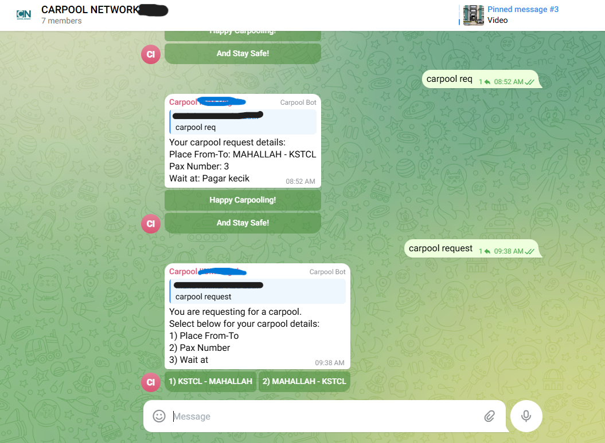
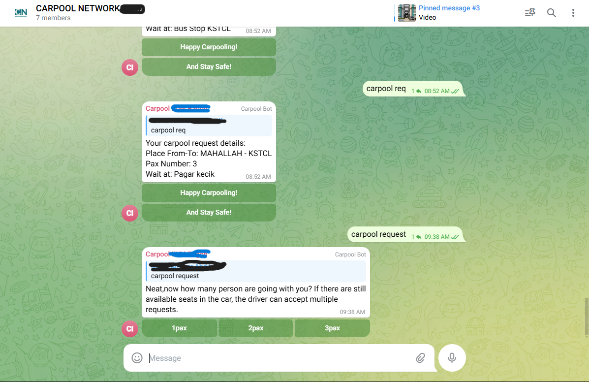
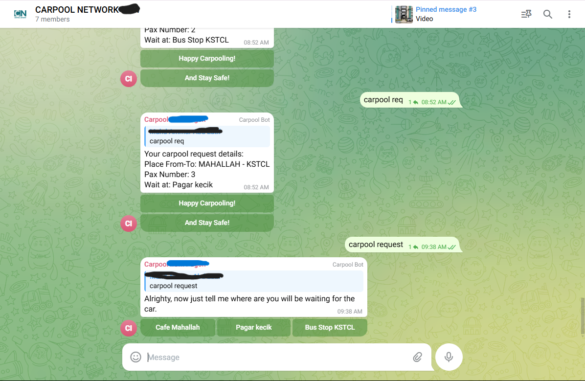
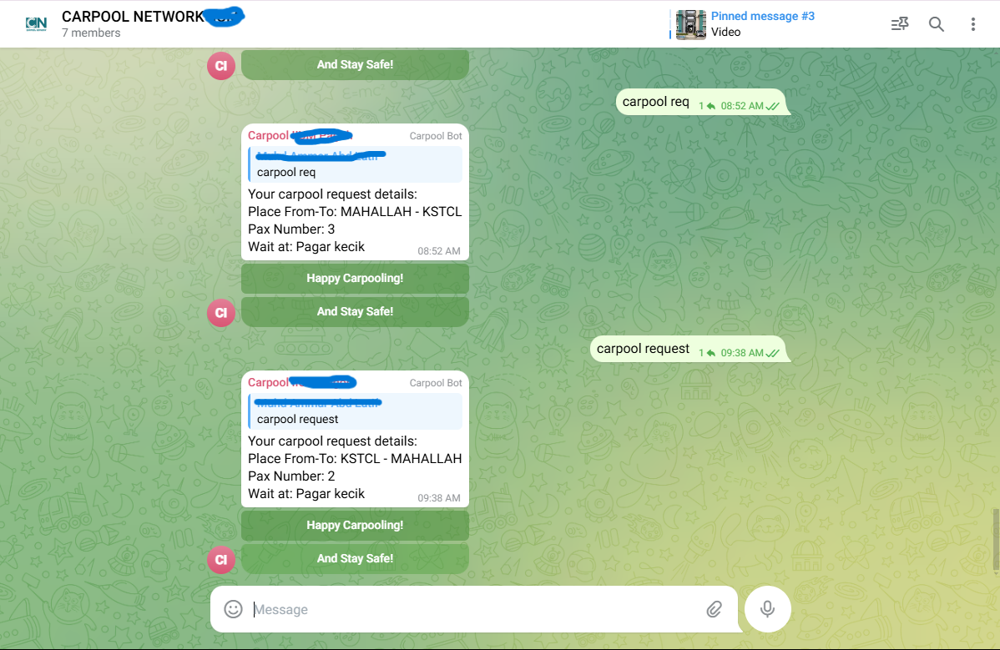
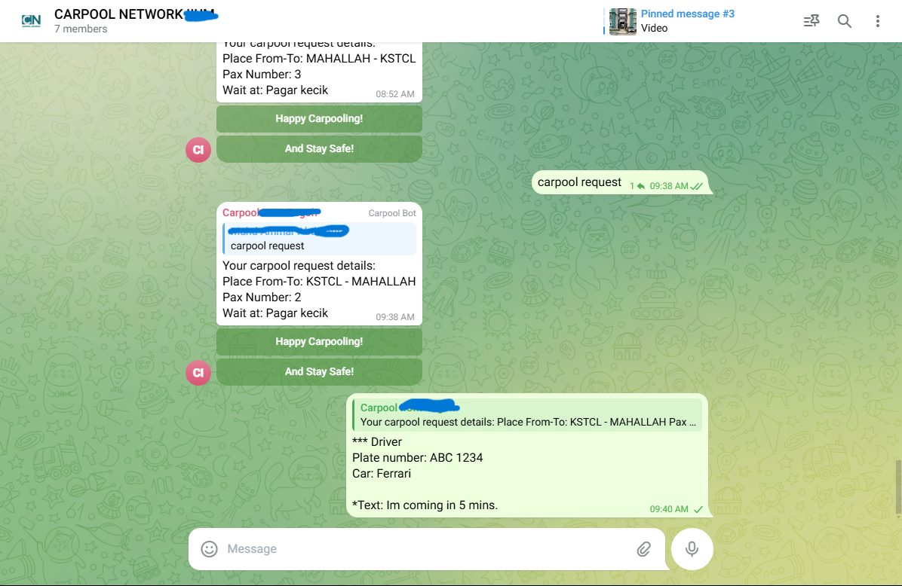

# This is my first and small project to provide carpool service in my campus. 
# It uses the python-telegram-bot module. Link to the module: https://github.com/python-telegram-bot/python-telegram-bot.git

Create a bot and invite it into a group, and make the bot admin.

What the bot will do:
 1) The bot will respond to the text: Carpool Request
 2) Inline keyboard (Boxes where you can click the details) will come out.
 3) User can choose the Place From-To, by clicking at the keyboard buttons.
 4) User can choose how many person is requesting the carpool. 
 5) User can choose where the person will wait for the carpool. 
 6) When all details has been chosen, The bot ends with the details that user choose as a template. 

Then, the driver can accept it by replying to the template and informing their car details (plate number, car type etc..)
Then, students can carpool happilly. 

# Students in the group can request for the carpool by typing: (Carpool request/carpool req)
# Then, choose the provided place From-To
 

# Students choose the number of person that is requesting the carpool.

# Students choose the place where they will be waiting for the carpool.

# The request details will be in the template of this:

# The driver can accept the carpool request by telling their car details.

""" I am currently working on making the bot filters the telegram group so that only students from my campus can enter it. """
""" For safety reason, and for the drivers, I want them to register their driving license, car plate number etc.. so that """
""" if anything happens, I can trace who is the owner of the car. This will ensure students feel much more safer using the service. """
""" I am still a beginner, and very open for any feedback, opinions suggestion. """
""" Thank You! """

